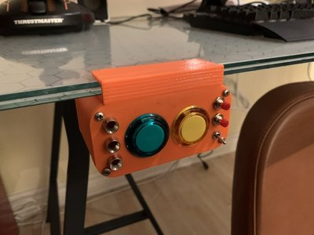

# button_panel

A button panel to control games on a PC.

It's based on an Arduino Micro, because that board connects to the PC as a USB device, and can act as a keyboard.

When you press a button on this board, a keypress is sent to the computer. You can bind that keypress to a key binding in a game or other application.

## Keys

The code in this repo sends the following key combinations:

- RIGHT_SHIFT + a
- RIGHT_SHIFT + b
- RIGHT_SHIFT + c
- RIGHT_SHIFT + d
- RIGHT_SHIFT + e

These key combinations can be changed by editing [`button_panel.ino`](https://github.com/nickthecook/button_panel/blob/master/button_panel.ino#L62).

## Buttons

The design uses:

- 2 30mm arcade buttons (e.g. [these](https://www.adafruit.com/?q=30mm%20arcade%20button))
- 2 10mm momentary switches (e.g. [these](https://www.amazon.ca/Twidec-Normal-Momentary-Button-PBS-110-R/dp/B07Q8JJZMV/ref=sr_1_23_sspa?keywords=10mm+momentary+switch&qid=1580699061&sr=8-23-spons&psc=1&spLa=ZW5jcnlwdGVkUXVhbGlmaWVyPUEzUFhHQUpNNlpEMFlZJmVuY3J5cHRlZElkPUEwNzU0MTYyM0cxT0o2RFRQT1pFTyZlbmNyeXB0ZWRBZElkPUEwNTQxMTQxM0RETkJQUTRBSUtLNSZ3aWRnZXROYW1lPXNwX210ZiZhY3Rpb249Y2xpY2tSZWRpcmVjdCZkb05vdExvZ0NsaWNrPXRydWU=))
- 1 10mm toggle switch (e.g. [these](https://www.amazon.ca/Connection-Position-Accessories-Fittings-Switches/dp/B07QX97LSC/ref=sr_1_5?keywords=10mm+toggle+switch&qid=1580699105&sr=8-5))
- 3 5mm-LED panel mounts (e.g. [these](https://www.amazon.ca/Copper-Display-Accessory-Light-Emitting-Lighting/dp/B01M4RUY4M/ref=sr_1_23_sspa?keywords=10mm+led+panel+mount&qid=1580699174&sr=8-23-spons&psc=1&spLa=ZW5jcnlwdGVkUXVhbGlmaWVyPUEyMkZPN1dXTjlFTEpGJmVuY3J5cHRlZElkPUExMDMzNTcxMVJRQUpYWlkyWEFORSZlbmNyeXB0ZWRBZElkPUEwOTU1MTQ3M05HMjJBMFQ0SkswWSZ3aWRnZXROYW1lPXNwX210ZiZhY3Rpb249Y2xpY2tSZWRpcmVjdCZkb05vdExvZ0NsaWNrPXRydWU=))

Those aren't the exact parts, with the exception of the arcade buttons, but they're all pretty standard, and should fit the [design files](design).
